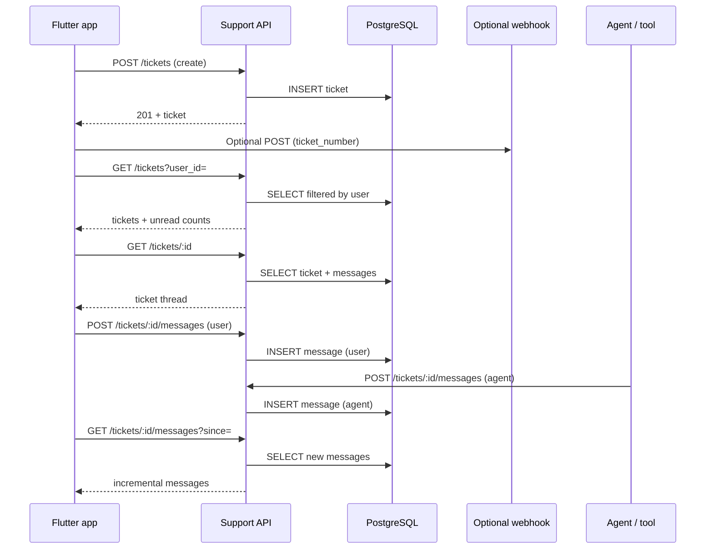

# Support Ticket API - Node.js Backend

RESTful API for customer support ticket management system built with Node.js, Express, and PostgreSQL.

## Features

- ✅ Create support tickets
- ✅ View user tickets
- ✅ Real-time messaging
- ✅ Agent replies
- ✅ Ticket status management
- ✅ Priority management
- ✅ Ticket assignment
- ✅ Message read status

## Tech Stack

- **Runtime:** Node.js
- **Framework:** Express.js
- **Database:** PostgreSQL
- **Environment:** dotenv

## Backend architecture

### Process and HTTP layer

- **`server.js`** boots an **Express** app, enables **CORS** and **`express.json()`**, and listens on **`PORT`** (default `3000`).
- A **`pg.Pool`** connects to PostgreSQL using **`DB_*`** variables from **`.env`**. A startup query (`SELECT NOW()`) verifies connectivity.
- Routes under **`/api/v1/support`** implement tickets and messages. Unknown paths return **404** JSON; thrown errors are handled by an error middleware (**500**).

### Data store

Two main concepts (tables must match what `server.js` queries):

| Table | Role |
|--------|------|
| **`tickets`** | One row per ticket: UUID `id`, human-readable **`ticket_number`** (e.g. `TKT-2026-000001`), contact fields, `subject`, `description`, `status`, `priority`, `category`, assignment fields, timestamps, optional **`metadata`** (JSON). |
| **`ticket_messages`** | Chat lines: `ticket_id`, `sender_type` (`user` \| `agent`), `sender_id`, `sender_name`, `message`, `attachments`, `is_read`, `read_at`, timestamps. |

### User identity (`user_id`)

The API accepts an app-specific **`user_id`** string from the client:

- If it matches a **UUID**, it is stored in **`tickets.user_id`** and listing filters with `WHERE user_id = …`.
- If it is **not** a UUID (e.g. Shopify GID), **`user_id` may be null** on the row and the original value is stored under **`metadata.original_user_id`**. Listing then filters with `metadata->>'original_user_id'`.

This lets one backend serve both UUID-based apps and opaque storefront IDs.

### Ticket identifiers in URLs

For **`GET` / `POST` / `PATCH`** on a single ticket, the **`:id`** parameter may be either:

- the ticket’s **UUID** (`id`), or  
- the **`ticket_number`** (e.g. `TKT-2026-000001`).

The server detects the format and resolves the internal UUID before reads/writes.

### Security model (as implemented)

- **Create ticket** and **list tickets** require **`user_id`**; the list query **never** returns all tickets—it always filters by that user.
- **Single-ticket GET** and some message operations identify the ticket **by id/number only**. For public deployments, consider adding **auth** (e.g. JWT/session) and verifying that the caller owns the ticket.
- Queries use **parameterized SQL** to reduce injection risk.

---

## End-to-end flow (full)

Below is the full journey from the mobile app through this API to storage and back—including optional automation and support tools.

### Actors

- **Customer** — uses the Flutter app (`flutter_support_tickets` package or equivalent client).
- **Support ticket API** — this Node server + PostgreSQL.
- **Optional: n8n / webhook** — notified after ticket creation (configured in the app’s `SupportTicketsConfig.ticketCreatedWebhookUrl`, not inside `server.js`).
- **Optional: agent / ERP / script** — sends **agent** messages or updates status via the same REST API.

### 1. App configuration (once per app launch)

1. The host app wraps **`MaterialApp`** with **`SupportTicketsScope`** and a **`SupportTicketsConfig`**: **API base URL** (this server), **default avatar**, optional **webhook URL**, and **`resolveUser`** (maps your logged-in user → `SupportTicketsUser` with `id`, name, email, phone, etc.).
2. The Flutter **`SupportTicketService`** sends all HTTP calls to `{baseUrl}/api/v1/support/...`.

### 2. Customer opens “Support tickets”

1. **`GET /api/v1/support/tickets?user_id=<id>&page=&limit=`**  
   - Server **requires** `user_id`.  
   - Returns only that user’s tickets (UUID or `metadata.original_user_id` path).  
   - Enriches each row with **`unread_message_count`** (unread **agent** messages).
2. The app shows the list; tapping a row opens the chat screen with the ticket **UUID** (or navigates by route with ticket id).

### 3. Customer creates a ticket

1. User fills the form; app sends **`POST /api/v1/support/tickets`** with JSON:  
   `user_name`, `user_email`, `user_phone`, `subject`, `description`, **`user_id`**, optional `category`, `priority`.
2. Server validates fields; **401** if `user_id` is missing.  
3. Server allocates the next **`ticket_number`** for the current year, inserts **`tickets`**, returns **`201`** with `data.ticket`.
4. **Optional (client-side):** the Flutter app may call an external **webhook** (e.g. n8n) a few seconds later with `ticket_number` and `category`—that is **not** emitted by `server.js`; it is app configuration.

### 4. Customer opens a ticket (detail + history)

1. App calls **`GET /api/v1/support/tickets/:id`** where `:id` is UUID or `ticket_number`.  
2. Server loads the ticket row and **all** rows from **`ticket_messages`** for that ticket, ordered by time.  
3. UI renders the thread; app may call **`POST /api/v1/support/tickets/:id/messages/read`** to mark agent messages read (all agent messages, or specific `message_ids`).

### 5. Customer sends a chat message

1. App **`POST /api/v1/support/tickets/:id/messages`** with `message`, optional `attachments`, `user_id`, `user_name` (defaults align with the ticket for **user** messages).  
2. Server resolves the ticket, inserts into **`ticket_messages`** with **`sender_type: user`**, updates **`tickets.updated_at`**.  
3. Response returns the new message row.

### 6. Polling for new messages (app stays in sync)

1. The chat screen periodically calls **`GET /api/v1/support/tickets/:id/messages`** with query params such as **`since=<ISO timestamp>`** to fetch only newer messages (incremental sync).  
2. Server filters `ticket_messages` by `ticket_id` and optional `since`, with pagination (`page`, `limit`).  
3. When the app is backgrounded, polling typically pauses (client behavior).

### 7. Support / agent replies (same API)

1. A dashboard, n8n HTTP step, or ERP integration calls **`POST /api/v1/support/tickets/:id/messages`** with **`sender_type: "agent"`** and appropriate **`sender_name`** / **`sender_id`**.  
2. Server inserts an **agent** row; the customer’s app sees it on the next list refresh or message poll.  
3. Unread counts for the list use agent messages with **`is_read = false`**.

### 8. Ticket lifecycle updates

1. **`PATCH /api/v1/support/tickets/:id`** with body fields such as **`status`** (`open` \| `in_progress` \| `resolved` \| `closed`), **`priority`**, **`assigned_to`**, **`assigned_to_name`**, **`category`**.  
2. Server validates enums; may set **`resolved_at` / `closed_at`** when status changes.  
3. Customer app can reflect status from **`GET`** responses or after agent updates.

### 9. Health and operations

- **`GET /api/health`** — quick check that the process is up (useful for load balancers and monitoring).

### Flow diagram (summary)



---

## Where to change URLs and credentials

### Flutter app (client)

The mobile app **does not** store the database password. It only needs the **public HTTPS base URL** of your deployed API.

| What | Where to change |
|------|------------------|
| **API base URL** (e.g. `https://your-api.example.com`) | In your app’s **`SupportTicketsConfig.apiBaseUrl`**, usually in one central place. In **this** repo that is **`lib/support_tickets_binding.dart`** inside `buildSiyaSupportTicketsConfig()`. In another app, create the same config (any filename) and pass it to **`SupportTicketsScope`**. |
| **Optional ticket-created webhook** (n8n, etc.) | **`SupportTicketsConfig.ticketCreatedWebhookUrl`** — same binding file, or `null` to disable. |
| **Default avatar** | **`SupportTicketsConfig.defaultAvatarUrlOrAsset`** — URL or `assets/...` path (must be in your app’s `pubspec` assets if using assets). |
| **Map your logged-in user** | **`SupportTicketsConfig.resolveUser`** — replace `Provider.of<UserModel>…` with **your** auth (Firebase, Supabase, etc.). |

**REST path prefix** (`/api/v1/support/...`) is defined in the **`flutter_support_tickets`** package (`SupportTicketService`). You normally **only change the host** via `apiBaseUrl`. Changing path prefixes would require editing the package or forking it.

### Backend server (Node + PostgreSQL)

| What | Where to change |
|------|------------------|
| **Database host, name, user, password** | **`backend/.env`** on the machine that runs `server.js`: `DB_HOST`, `DB_PORT`, `DB_NAME`, `DB_USER`, `DB_PASSWORD`. |
| **HTTP port** | **`PORT`** in the same `.env` (default `3000` in code if unset). |
| **Fallback defaults** | `server.js` still has default `DB_HOST` / pool settings if env vars are missing—**set `.env` in production** so you are not relying on defaults. |

After deploying the API to a host (e.g. `https://api.yourbrand.com`), set the Flutter app’s **`apiBaseUrl`** to that origin **without** a trailing slash (the client normalizes it).

---

## Quick Start

### 1. Install Dependencies

```bash
npm install
```

### 2. Configure Environment

Create `.env` file:

```env
PORT=3000
DB_HOST=13.202.148.229
DB_PORT=5432
DB_NAME=support_tickets
DB_USER=dba
DB_PASSWORD=your_password
NODE_ENV=development
```

### 3. Start Server

**Development:**
```bash
npm start
```

**Production (with PM2):**
```bash
pm2 start server.js --name "support-ticket-api"
```

## API Endpoints

### Health Check
- `GET /api/health` - Server health check

### Tickets
- `POST /api/v1/support/tickets` - Create ticket
- `GET /api/v1/support/tickets` - Get user tickets
- `GET /api/v1/support/tickets/:id` - Get ticket details
- `PATCH /api/v1/support/tickets/:id` - Update ticket (status, priority, assignment)

### Messages
- `POST /api/v1/support/tickets/:id/messages` - Send message
- `GET /api/v1/support/tickets/:id/messages` - Get messages
- `POST /api/v1/support/tickets/:id/messages/read` - Mark as read

## Documentation

- [Postman Testing Guide](./POSTMAN_TESTING_GUIDE.md)
- [Agent Workflow Guide](./AGENT_WORKFLOW_GUIDE.md)
- [Deployment Guide](./DEPLOYMENT_GUIDE.md)

## Database Setup

Run the SQL script to create tables:

```bash
psql -h your_host -U your_user -d your_database -f database_setup.sql
```

Or use pgAdmin to execute `database_setup.sql`

## Security

- ✅ **`user_id` required** for creating and listing tickets; list queries are always scoped to that user
- ✅ Input validation on create/update; parameterized queries (**SQL injection** mitigation)
- ⚠️ **Hardening for production:** add auth (JWT/session) and ownership checks on single-ticket routes if IDs could be guessed—see **Backend architecture** above

## License

MIT

